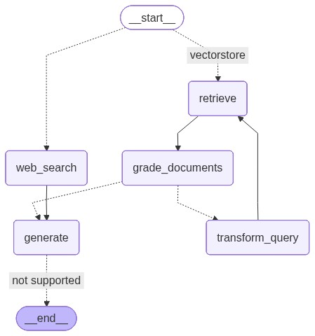

# Adaptive Aviation RAG

A self-correcting multi-agent RAG system that intelligently retrieves and validates answers. Features hybrid retrieval combining vectorstore with web search via Tavily, automatic query transformation for improved results, hallucination detection, and smart document grading to ensure accuracy at every stage.

## Overview

Adaptive Aviation RAG is a retrieval-augmented generation app designed to provide accurate, verified answers about aviation and NTSB reports. The system combines intelligent document retrieval with multi-stage grading and hallucination detection to ensure reliability and prevent misinformation.

## Features

- **Self-Correction**: Automatically detects and corrects poor responses through multi-stage validation
- **Multi-Agent Architecture**: Combines local vectorstore search with Tavily web search for comprehensive retrieval
- **Hybrid Retrieval**: Uses vectorstore + BM25 ranking for intelligent document selection
- **Query Transformation**: Automatically rewrites queries when initial retrieval fails
- **Hallucination Detection**: Grades generated answers against retrieved documents to prevent false information
- **Document Grading**: Intelligently scores document relevance and quality
- **Adaptive Retry Logic**: Prevents infinite loops while refining answers through intelligent retries
- **Conversation Context**: Maintains and leverages message history for coherent multi-turn interactions

## Tech Stack

- **LLM**: OpenAI GPT models
- **Vector Database**: Chroma
- **Web Search**: Tavily API
- **Framework**: LangChain
- **UI**: Streamlit
- **Graph Processing**: LangGraph
- **Language**: Python 3.12


## Installation
To install the Adaptive Aviation RAG project, follow these steps:
1. Clone the repository:
   ```bash
   git clone https://github.com/JSM2512/Adaptive-Aviation-RAG.git
   ```
2. Navigate into the project directory with environment creation:
   ```bash
   # Using conda
   conda create -n venv python=3.12
   conda activate venv/
   ```
3. Install the required dependencies:
   ```bash
   pip install -r requirements.txt
   ```

## Usage with Streamlit
To use the Code with Streamlit:
1. Go to terminal:
   ```python
   streamlit run app.py
   ```
2. This will run the app on your browser.

## System Architecture



*The graph shows the multi-stage validation and self-correction flow of the system.*

